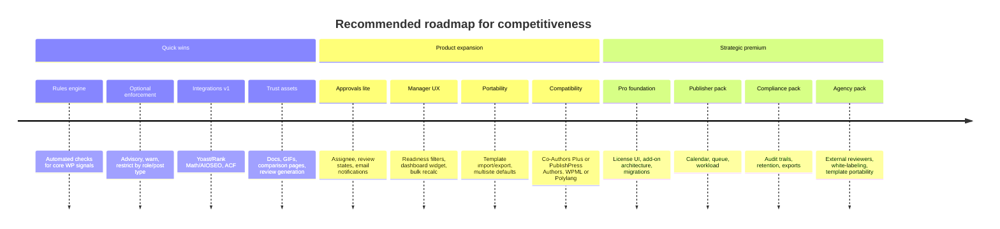

# Editorial Workflow Manager Competitive Analysis

## Executive summary

**Editorial Workflow Manager** is already strong where many WordPress workflow plugins are weak: it is **Gutenberg-first, lightweight, accessibility-conscious, and low-friction**. The free version offers reusable checklist templates, required/optional items, helper text and links, post-type mapping, readiness indicators in multiple admin surfaces, a Quickstart wizard, an editor tour, starter templates, backward-compatible upgrades, and a non-blocking pre-publish warning. It is also explicitly admin-only, with no front-end output, and recent releases tightened asset loading, memoization, sanitization, and onboarding UX. citeturn4view1turn23view1turn23view0turn34view0

That positioning is valid, but the market leaders win on **three things your free version does not yet do**: **automated validation rules**, **optional enforcement / approvals**, and **broader ecosystem integrations**. PublishPress Checklists is the closest direct competitor because it turns editorial requirements into measurable rules and can require completion before publish; Oasis Workflow wins on multi-step approvals and workflow automation; PublishPress Planner, Editorial Calendar, SchedulePress, and Nelio Content win on calendar-led planning; Jumplinks Flow has a newer “review on rendered page” approval angle that feels more modern than many legacy workflow tools. citeturn15view2turn11view0turn24search6turn15view1turn11view3turn9view4turn11view4turn9view5turn11view5turn9view6turn32search15turn14search0

The clearest competitive path is **not** to become a full PublishPress-style suite immediately. The best move is to deepen your current wedge: become the **best checklist-quality gate plugin for Gutenberg-first teams**. In practice, that means shipping a rules engine, optional publish control, and the integrations that users expect to validate editorial quality inside WordPress: **Yoast/Rank Math/AIOSEO, ACF, Co-Authors Plus or PublishPress Authors, Multisite, and WPML/Polylang**. After that, add lightweight approvals and notifications; only then should you invest in a full calendar/workload layer or compliance-grade audit capabilities. This sequencing is consistent with both the current market and the premium ladder direction already outlined in your existing research report. citeturn5view0turn15view2turn27search0turn27search5turn24search6turn32search9

My highest-confidence recommendation is therefore: **win “editorial quality assurance in the editor” first, then extend into approvals, then into management/governance**. That path preserves your strongest differentiator—clarity and speed in Gutenberg—while building a premium story users will actually pay for. citeturn4view1turn15view2turn24search6turn32search15

## Current product position and UX

Your current product is aimed at **content teams, editors, agencies, and multi-author sites** that want a consistent pre-publish checklist without a heavy workflow suite. The plugin’s official listing and repository emphasize reusable templates, different checklist mappings per post type, required-versus-optional items, helper texts and reference URLs, per-post checklist state, readiness indicators in the editor and list table, starter templates, Quickstart onboarding, an editor tour, and non-blocking warnings rather than hard gates. The scope notes in the repository are also explicit: **Gutenberg only, no Classic Editor, no front-end output, and readiness depends only on required items**. citeturn4view1turn23view1turn33view1

In UX terms, the plugin currently supports three strong flows. First, the **new-site admin setup flow**: activate the plugin, run Quickstart, choose post types, assign starter templates, open the editor, and see the one-time sidebar tour. Second, the **author flow**: edit in Gutenberg, complete checklist items in the sidebar, monitor readiness in the status panel and pre-publish panel, receive a non-blocking warning if required items remain incomplete, and publish when ready. Third, the **editor or manager flow**: create or duplicate templates, reorder checklist rows, assign templates by post type, and scan readiness in the posts list table. These flows are unusually polished for a young free plugin and are already more deliberate than many small WordPress workflow plugins. citeturn4view1turn23view1

Technically, the free version has a good base. You already note **scoped editor assets**, **shared server-side readiness calculation**, **lazy cache metadata**, **cache invalidation when mappings/templates change**, **memoized checked-item normalization**, and **consolidated Gutenberg subscriptions**. Security and maintainability signals are also positive: the repository exposes a `composer.json` with WordPress Coding Standards tooling via PHPCS, the changelog calls out validation and sanitization improvements, uninstall cleanup exists, and the main bootstrap class uses capability checks, nonce verification, and safe redirects for dismissible admin notices. The visible gap is automated test coverage: the public repository shows PHPCS tooling and structure, but no visible test directory in the top-level tree. citeturn23view1turn23view0turn33view1turn34view0

Commercially, the plugin’s biggest weakness right now is **market trust, not product shape**. The WordPress.org listing shows **100+ active installs, no reviews yet, and no public ratings**, which means the plugin competes against products with years of reputation, review volume, and documentation depth. PublishPress Planner alone has **6,000+ installs and 4.9/5**, Editorial Calendar has **20,000+ installs and 4.9/5**, and SchedulePress has **10,000+ installs and 4.6/5**. citeturn10view0turn10view2turn10view6turn11view3turn10view7turn11view4turn10view8turn11view5

## Competitor comparison

The table below compares your plugin with **eight credible competitors** across the core decision criteria buyers use in this category: editorial QA, approvals, planning, integrations, pricing, and market trust. “URL” is provided as the official listing or official product page via citation links.

| Plugin | Official page | Key features | Free vs paid | Pricing | Ratings | Unique strengths | Weaknesses |
|---|---|---|---|---|---|---|---|
| **Editorial Workflow Manager** | WP.org listing citeturn4view1 · GitHub repo/report citeturn33view1turn5view0 | Reusable checklist templates, required/optional items, helper text + links, post-type mapping, Gutenberg sidebar, readiness in list table/status/pre-publish, starter templates, Quickstart, editor tour, backward-compatible UUID migration. citeturn4view1turn23view1 | Free only today. citeturn4view1 | Free. citeturn4view1 | No reviews yet; 100+ installs. citeturn10view0turn10view2 | Cleanest **Gutenberg-native checklist UX** in the set; strong onboarding and accessibility messaging. citeturn4view1turn23view1 | No automated rules, no approvals, no calendar, no Classic Editor UI, no public trust signal yet. citeturn23view1turn10view2 |
| **PublishPress Checklists** | WP.org citeturn9view0 · official page/pricing citeturn15view2turn19search0 | Checklist requirements, min/max word counts, featured image, broken links, tags/categories, role-based approval requirement, OpenAI checks; can block publish if requirements are required. citeturn15view2turn11view0 | Freemium. citeturn9view0turn19search0 | $49 / $99 / $199 annual for 1 / 5 / unlimited sites. citeturn19search0 | 5.0/5 from 24 reviews; 3,000+ installs. citeturn11view0turn10view3 | Closest direct rival; strongest **quality-gate** positioning; documented support for Yoast and ACF in newer releases. citeturn15view2turn27search0turn27search6 | Heavier “gatekeeping” model; more suite-oriented than lightweight; less differentiated on in-editor simplicity. citeturn15view2turn15view0 |
| **Oasis Workflow** | WP.org citeturn9view2 · official site/pricing citeturn24search6turn15view5 | Visual workflow designer, inbox, reminders, workflow history, unlimited workflows, auto-submit, revised published content workflows, Elementor integration, multisite support. citeturn24search6turn15view5 | Free Lite + paid plans + add-ons. citeturn15view5turn24search7 | Lite free; Pro $119, Business $299, Business Plus $899 annual. Add-ons extra. citeturn15view5turn24search9 | 4.8/5 from 51 reviews; 700+ installs. citeturn11view2turn10view5 | Strongest **multi-step approval** product in the set; ACF Compare add-on; WPML and multisite documentation exist. citeturn24search2turn24search0turn24search5 | More admin-heavy and expensive; older-style enterprise workflow feel; add-on model can raise complexity. citeturn24search6turn24search7turn15view5 |
| **PublishPress Planner** | WP.org citeturn9view3 · official page/pricing citeturn15view1turn19search1 | Content calendar, content overview, Kanban board, editorial notifications, drag/drop scheduling, filtering by status/category/user/post type. citeturn9view3turn15view1 | Freemium. citeturn9view3turn19search1 | $49 / $99 / $199 annual. citeturn19search1 | 4.9/5 from 178 reviews; 6,000+ installs. citeturn11view3turn10view6 | Strongest **calendar-first** WordPress-native planner; sits inside a broader PublishPress ecosystem. citeturn15view1turn12search20 | Not a direct checklist product; fuller workflows often require combining multiple PublishPress plugins. citeturn15view0turn15view1 |
| **Edit Flow** | WP.org citeturn28search0 · official blog/docs citeturn29search0turn29search8 | Calendar, custom statuses, editorial comments, editorial metadata, notifications, story budget, user groups. citeturn28search0 | Free. citeturn28search0 | Free. citeturn28search0 | 4.2/5 from 50 reviews; 4,000+ installs. citeturn11view1turn10view4 | Open-source baseline; broad editorial toolkit; long-lived and recognizable. citeturn28search0 | More legacy feel; multisite is per-subsite only, not network-wide; less focused than your narrow QA use case. citeturn28search1 |
| **Editorial Calendar** | WP.org citeturn9view4 | Drag/drop calendar, quick edits, drafts drawer, post status visibility. citeturn9view4 | Free. citeturn9view4 | Free. citeturn9view4 | 4.9/5 from 80 reviews; 20,000+ installs. citeturn11view4turn10view7 | The most popular lightweight planning baseline; easy to understand and easy to adopt. citeturn9view4turn10view7 | Only supports posts in FAQ; no approvals or checklist enforcement; even its optional data collection is spelled out publicly. citeturn9view4 |
| **SchedulePress** | WP.org citeturn9view5 · official product/pricing/docs citeturn21search1turn30search12turn30search8 | Visual schedule calendar, auto scheduler, manual scheduler, missed schedule handling, social auto-sharing, Classic Editor support, Gutenberg support, Elementor scheduling docs, advanced scheduling for updates. citeturn9view5turn30search12turn30search8turn30search2 | Freemium. citeturn9view5turn30search9 | Starts at $39/year for 1 site; official snippets show $149 annual unlimited and $399 lifetime unlimited options. citeturn18search0turn21search1 | 4.6/5 from 201 reviews; 10,000+ installs. citeturn11view5turn10view8 | Strong scheduling and distribution story; excellent support responsiveness on WP.org; broad editor compatibility. citeturn31view4turn30search12turn30search2 | Not an editorial approvals product; social connectors add operational complexity, visible in frequent changelog fixes. citeturn31view4 |
| **Nelio Content** | WP.org citeturn9view6 · official help/pricing pages citeturn25search0turn32search2turn16search0 | Editorial calendar, social auto-posting and re-sharing, editorial comments, editorial tasks, custom statuses, notifications, quality analysis, future actions. citeturn9view6turn32search0turn32search1turn32search5turn32search9 | Freemium. citeturn9view6turn32search16 | Official pricing pages expose Starter Free + Basic/Standard/Plus plans, but exact numeric pricing was not reliably available in the retrievable HTML here. citeturn16search0turn17search4turn32search2 | 4.4/5 from 104 reviews; 4,000+ installs. citeturn11view6turn10view9 | Very broad **plan-write-promote** workflow; fully compatible with Gutenberg and Classic Editor; WordPress VIP partnership references it for editorial calendar use. citeturn25search1turn32search14turn17search9 | Social-marketing emphasis may feel broader than pure editorial QA; heavier product surface area than your current niche. citeturn9view6turn32search15 |
| **Jumplinks Flow** | WP.org citeturn14search0 | Reviewer assignment, inline comments on rendered pages, approve/request changes, status-change notifications, support for Gutenberg, Classic Editor, Elementor, Bricks, Beaver Builder, Divi, Avada, Breakdance, custom post types, WooCommerce; Pro adds multiple reviewers, external reviewers, site-wide review, Slack, richer comments, device selector, activity tracking. citeturn14search0 | Free + Pro. citeturn14search0 | Pro exists, but numeric pricing was not surfaced in retrievable public sources during this research. citeturn14search0 | 5.0/5 from 6 reviews; fewer than 10 installs. citeturn11view8turn10view11 | Most modern **review/approval** UX angle; rendered-page feedback is compelling for agencies and clients. citeturn14search0 | Very early market signal; low install base; positioning overlaps only partially with your checklist-centric product. citeturn10view11turn14search0 |

Two broad market patterns matter most. First, the strongest products are either **quality-gate tools** or **calendar/approval suites**, not “generic workflow” tools. Second, the more a plugin depends on social publishing, API connectors, or multiple editor integrations, the more operational fragility shows up in changelogs and ratings; SchedulePress is a good example, with frequent fixes around social connection flows, editor behavior, and publishing edge cases. citeturn15view2turn24search6turn31view4

For your plugin, that means the best near-term battle is **PublishPress Checklists**, not Oasis Workflow or Nelio Content. You can win with a clearer value proposition and lower cognitive load if you quickly close the rule-validation and integration gaps. citeturn4view1turn15view2turn24search6

## Gap analysis

The feature gap is easiest to understand by mapping it against real user jobs rather than individual competitor features.

| User need | Current fit in Editorial Workflow Manager | Competitor benchmark | Competitive gap |
|---|---|---|---|
| **Low-friction in-editor publishing checklist** | **Strong.** This is your best-fit use case today: Gutenberg sidebar, non-blocking warning, readiness UI, starter templates, onboarding. citeturn4view1turn23view1 | PublishPress Checklists is stronger on automation, but often more rules-heavy. citeturn15view2turn11view0 | Small. You already have a viable wedge. |
| **Automated editorial validation** | **Weak.** Your checklist items are manual guidance items today. citeturn23view1 | PublishPress Checklists validates words, images, tags/categories, approval role, and OpenAI-based checks. Nelio also exposes post-quality analysis hooks. citeturn15view2turn27search0turn32search5 | **Largest short-term product gap.** |
| **Approvals and accountability** | **Weak.** No assignees, approval states, due dates, activity log, or sign-off workflow in free version. citeturn23view1 | Oasis Workflow and Jumplinks Flow provide structured review/approval flows; Nelio supports comments, tasks, notifications, and statuses. citeturn24search6turn14search0turn32search0turn32search9 | Large. |
| **Content planning and calendar visibility** | **Weak.** You have readiness visibility but no calendar/workload/kanban layer. citeturn23view1 | Planner, Editorial Calendar, SchedulePress, and Nelio all provide calendar-led planning. citeturn15view1turn9view4turn9view5turn32search15 | Large for publishers; smaller for checklist-only buyers. |
| **Agency/client sign-off** | **Partial.** You support “client approval” checklists, but not actual reviewer assignment or external review. citeturn4view1turn23view1 | Jumplinks Flow is purpose-built for this, especially with review-on-rendered-page and external reviewer magic links in Pro. citeturn14search0 | Large. |
| **Ecosystem-aware checklists** | **Weak.** No public compatibility claims yet for Yoast, ACF, Co-Authors Plus, Multisite sync, or WPML. citeturn4view1turn23view1 | PublishPress Checklists documents Yoast, ACF, CPTs, WooCommerce, and multisite workarounds; Oasis documents WPML, multisite, and ACF add-ons. citeturn27search0turn27search5turn27search8turn24search0turn24search2turn24search5 | **Largest trust gap after automated rules.** |
| **Installation, upgrade, and migration UX** | **Strong.** Quickstart, per-user tour dismissal, starter templates, backward compatibility, capability-change notice. citeturn4view1turn23view1turn23view0 | Many competitors are fine here, but Pro transitions often involve multiple plugins/add-ons or separate steps. citeturn12search16turn30search7turn24search7 | Opportunity to become best-in-class if Pro ships as an extension, not a fork. |
| **Documentation, proof, and trust** | **Weak.** WP.org + GitHub are present, but there are no reviews yet and no broad knowledge base. citeturn4view1turn10view2turn33view1 | PublishPress, Nelio, SchedulePress, and Oasis all maintain deeper documentation libraries and mature product pages. citeturn27search1turn32search3turn30search0turn24search7 | Significant commercial gap. |

The practical conclusion is simple. **You already serve lightweight teams well; you do not yet serve teams that want proof, automation, or accountability.** That is why your next features should bias toward **machine-verifiable checklist completion** and **ecosystem compatibility**, not broad planning or enterprise governance first. citeturn23view1turn15view2turn27search0

## Recommended roadmap

The recommendations below are prioritized by likely effect on competitiveness and adoption, not by engineering elegance.

| Priority | Recommendation | Why it matters | Effort | Impact |
|---|---|---|---|---|
| **Now** | **Add a rules engine for automated checks**: featured image, excerpt, min/max word count, H1 count, categories/tags count, alt text presence, internal link count, required checklist date/author fields. | This closes the biggest gap versus PublishPress Checklists and instantly upgrades the product from “manual checklist” to “editorial QA system.” citeturn15view2turn27search6 | Medium | Very high |
| **Now** | **Add control modes per post type or role**: advisory, warning, restrict publish. | Your low-friction default is good, but some teams will only switch if they can enforce completion for specific workflows. Make blocking optional, not default. citeturn4view1turn15view2 | Medium | Very high |
| **Now** | **Ship first-party integrations** for **Yoast/Rank Math/AIOSEO** and **ACF**. | These are the most credible “must-have” integrations in checklist tools, and PublishPress already markets them. citeturn27search0turn27search6 | Medium | Very high |
| **Now** | **Add template import/export and “copy template to site” UX.** | This is high-value for agencies and multisite users, and it supports your likely premium path without requiring a full suite. PublishPress and Oasis both benefit from reusable admin configuration patterns. citeturn27search5turn24search5 | Small to medium | High |
| **Now** | **Improve manager visibility**: list-table filters by readiness, bulk readiness recalc, dashboard widget, quick view of incomplete required items. | You already have list-table readiness; turning it into a triage surface would increase everyday usefulness. citeturn23view1 | Small | High |
| **Soon** | **Add lightweight approvals**: assignee, “ready for review,” “approved,” “changes requested,” and simple notifications. | This is enough accountability for many teams without becoming Oasis Workflow. citeturn24search6turn14search0turn32search9 | Medium | High |
| **Soon** | **Add compatibility for Co-Authors Plus / PublishPress Authors and multilingual plugins.** | Multi-author attribution and translation workflows are common in editorial teams. This is also a strong enterprise and publisher trust signal. citeturn27search2turn24search0 | Medium | High |
| **Soon** | **Add Multisite network defaults and optional template sync.** | Editorial organizations and agencies often standardize processes across sites; PublishPress and Oasis both acknowledge this use case. citeturn27search5turn24search5 | Medium | High |
| **Later** | **Add calendar / workload / queue views** as a premium publisher-oriented layer. | Important, but only after you own the checklist-quality niche. Calendar competition is already crowded. citeturn15view1turn9view4turn9view5turn32search15 | Large | Medium to high |
| **Later** | **Add audit log, retention, exports, and compliance features.** | Valuable premium upside for regulated teams, but not necessary for your first monetized wedge. citeturn5view0turn24search6 | Large | Medium |
| **Always-on** | **Build documentation, demos, and review generation**: animated GIFs, comparison pages, integration docs, migration guides, support FAQs. | Your biggest commercial weakness is trust. Reviews and documentation are force multipliers. citeturn10view2turn27search1turn32search3turn30search0 | Small | Very high |
| **Always-on** | **Add automated test coverage**: PHPUnit for readiness/migrations/rules, E2E for editor flows, accessibility checks, compatibility matrix CI. | Current repo shows linting standards but no visible test directory; scaling into premium integrations without tests will slow you down. citeturn33view1turn34view0 | Medium | Very high |

A sensible release sequence looks like this:

If you want one ruthless rule for prioritization, use this: **do not build a calendar before you build the rules engine**. The calendar market is already crowded; the under-served opportunity is a modern, editor-native, compatibility-aware editorial QA layer. citeturn15view1turn9view4turn9view5turn15view2

## Monetization, integrations, and positioning

Your existing research report already points in the right direction: **Free → Pro → specialized Packs**. I agree with that structure, but I would tighten the tiers so the value ladder is easier to understand and easier to sell. Free should remain the “lightweight Gutenberg checklist” product. **Pro** should add the things that create immediate measurable value: automated checks, optional enforcement, approval states, notifications, import/export, integrations, and premium support. Then layer **Publisher**, **Agency**, and **Compliance** packs on top only once the Pro foundation is stable. That preserves a clean product story and matches how buyers in this category upgrade: from consistency, to accountability, to scale/governance. citeturn5view0turn15view2turn24search6

A practical premium structure would be:

- **Free**: current feature set, kept generous and opinionated.  
- **Pro**: rules engine, enforcement modes, approval states, notifications, template portability, premium integrations, premium support.  
- **Publisher Pack**: calendar, queue, workload, custom statuses, editorial dashboard.  
- **Agency Pack**: external reviewers, client-friendly approvals, white-label mode, per-client template bundles.  
- **Compliance Pack**: audit log, retention policy, exportable evidence, approval history, restricted sign-off controls. citeturn5view0turn24search6turn14search0

On pricing, the market provides good anchors. PublishPress Checklists and Planner both sit at **$49 / $99 / $199**, while Oasis Workflow starts meaningfully higher at **$119** and climbs sharply with business use. SchedulePress starts lower, around **$39/year**, but it is selling scheduling/social automation rather than editorial QA. Based on your current scope and likely first premium feature set, a very defensible launch price would be **Pro at $59–$79 for 1 site, $149 for 5 sites, and $249–$299 for unlimited**, with packs either bundled into higher tiers or sold as add-ons later. That would place you above “cheap utility plugin” territory but below heavyweight suites. citeturn19search0turn19search1turn15view5turn18search0turn21search1

For the **free-to-paid migration strategy**, the safest path is an **extension architecture**, not a sibling plugin that forks the data model. Your current plugin already uses versioned upgrade handling and backward-compatible template migration with UUID-based v2 items and legacy mirror meta, which is exactly the foundation you want for premium evolution. I would therefore recommend one of two models: either **free core + premium add-on**, or **free core + premium feature module loaded by license**, but **not** a separate “Pro replacement plugin” if you can avoid it. Users in this space already deal with multi-plugin suites from PublishPress and add-on packages from Oasis, so an extension model will feel normal and safer. citeturn23view1turn23view0turn12search16turn24search7

A simple migration flow should be:

For integrations and compatibility, I would prioritize this exact order: **Yoast/Rank Math/AIOSEO**, **ACF**, **Co-Authors Plus or PublishPress Authors**, **WPML/Polylang**, **Multisite**, then **WooCommerce products** if you want broader content operations use cases. That order follows both buyer expectation and competitor reality: PublishPress heavily markets SEO and ACF-aware checklists, Oasis documents WPML and ACF support, and agency/review tools increasingly support non-post content types and multiple editors. citeturn27search0turn27search6turn24search0turn24search2turn14search0

A useful automated compatibility checklist would include:  
**Core matrix** — WordPress 6.8 and 7.0.x, PHP 7.4 through current supported versions, single-site and multisite, with and without object cache.  
**Editor matrix** — Gutenberg baseline; Classic Editor fallback behavior if added later.  
**Plugin matrix** — Yoast, Rank Math, AIOSEO, ACF Free/Pro, Co-Authors Plus and/or PublishPress Authors, WPML and/or Polylang, WooCommerce, and at least one multilingual + SEO combination.  
**Automated suites** — PHPUnit for readiness calculations, rules validation, option migrations, permissions, uninstall cleanup; E2E browser tests for onboarding, checklist completion, pre-publish warnings, readiness column updates, and upgrade migrations; accessibility tests for keyboard order, focus management, live regions, and color contrast; static checks with PHPCS plus PHPStan or Psalm. The repository already has PHPCS wiring, so the next step is to add runtime confidence, not more linting. citeturn33view1turn34view0turn23view1turn23view0

For WordPress.org and marketing positioning, I would sharpen the message around **clarity, readiness, and Gutenberg-native editorial quality**. The strongest current copy angle is not “workflow suite.” It is:

> **The Gutenberg editorial checklist for teams that want consistent publishing quality without a bloated workflow suite.**

Suggested WordPress.org short description:

> **Reusable editorial checklists for Gutenberg with readiness tracking, starter templates, and low-friction pre-publish guidance.**

Suggested first paragraph for the listing:

> **Editorial Workflow Manager helps editors and content teams publish consistently by adding reusable editorial checklists directly into the WordPress block editor. Create templates, map them to post types, track readiness in the editor and post list, and guide authors with clear required-versus-optional tasks—without forcing a heavy workflow system on every post.**

Suggested value bullets for the listing and README:

- **Gutenberg-native** checklist sidebar with readiness feedback.  
- **Reusable templates** with required and optional items.  
- **Fast setup** with starter templates, Quickstart, and editor tour.  
- **Low-friction by default** with optional stronger controls in Pro.  
- **Built for editorial QA**, not generic task management.  

Suggested comparison messaging for content marketing:

- **Versus PublishPress Checklists**: simpler, cleaner, more editor-native; best for teams that want clarity before they want enforcement.  
- **Versus Oasis Workflow**: lighter and faster for checklist-first editorial teams; easier to adopt when you do not need enterprise approvals from day one.  
- **Versus calendar plugins**: focuses on content quality inside the editor, not just scheduling outside it. citeturn15view2turn24search6turn15view1turn9view4turn9view5

The most effective marketing channels for this product are likely to be **WordPress.org listing optimization, GitHub README/docs, short demo GIFs or videos, integration-focused comparison posts, and use-case pages for agencies, publishers, and SEO teams**. Competitive buyers in this category often search for comparisons or a concrete pain point—“Yoast checklist,” “editorial checklist Gutenberg,” “WordPress content approval,” “pre-publish checklist,” “checklist for ACF posts”—more than they search for a brand name. Your content strategy should reflect that. citeturn4view1turn15view2turn27search0turn24search6turn14search0