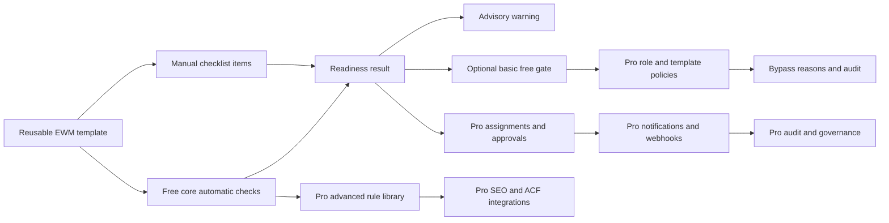
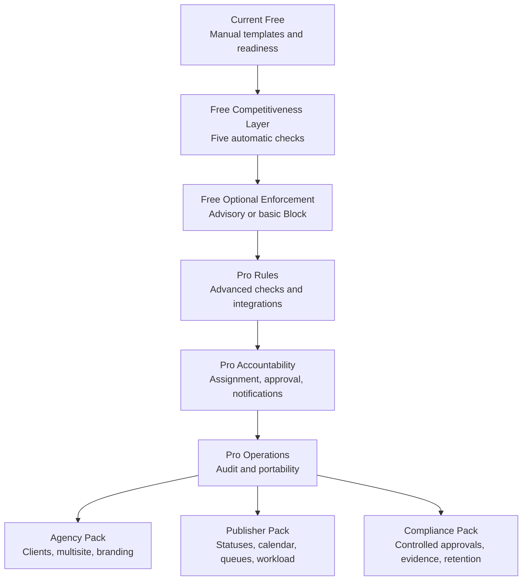

# Competitive Research and Free/Pro Packaging Analysis for Editorial Workflow Manager

## Executive summary

**Editorial Workflow Manager is already a complete free product within its deliberately narrow category:** a Gutenberg-native, reusable editorial-checklist and readiness system. Its strongest free differentiators are reusable templates, required versus optional tasks, helper text and reference links, post-type mapping, per-post completion state, list-table readiness visibility and filtering, missing-item diagnostics, bulk recalculation, manager summaries, starter templates, onboarding, accessibility, and backward-compatible data handling. It avoids front-end output, telemetry, hard publishing restrictions, and the complexity of a full editorial-planning suite. ([wordpress.org](https://wordpress.org/plugins/editorial-workflow-manager/))

The principal competitive weakness is not calendars, Kanban boards, social scheduling, or project management. It is that the closest direct competitor, **PublishPress Checklists**, includes a substantial automated validation library and enforceable required tasks in its free version. Free users can validate title and excerpt lengths, body word count, featured images, image alternative text and captions, links, permalinks, taxonomies, and role-based approval; required checks can prevent publication. It also exposes an extension model for custom automatic checks. ([wordpress.org](https://wordpress.org/plugins/publishpress-checklists/))

The broader workflow market also establishes free expectations around assignments, approvals, notifications, statuses, and history. Oasis Workflow provides visual multi-step routing, assignments, inboxes, custom statuses, reassignment, due dates, reminders, and process history for free; PublishPress Revisions provides submission, approval, rejection, scheduling, comparison, and notifications for revisions; Jumplinks Flow provides single-reviewer assignment, rendered-page feedback, inline comments, approval or change requests, and email notifications. ([wordpress.org](https://wordpress.org/plugins/oasis-workflow/))

Nevertheless, most of those products solve a **different primary problem**. PublishPress Planner, Edit Flow, Editorial Calendar, Nelio Content, and SchedulePress emphasize calendars, pipeline visibility, scheduling, notifications, content promotion, or social distribution. Attempting to match those suites would weaken Editorial Workflow Manager’s lightweight positioning and reproduce functionality available from mature plugins with thousands or tens of thousands of installations. ([wordpress.org](https://wordpress.org/plugins/publishpress/))

The recommended packaging decision is therefore selective:

| Packaging decision | Recommendation |
|---|---|
| **Move into free** | A deliberately limited **Automated Requirements Lite** library: featured image present, excerpt present, minimum word count, minimum category/tag presence, and image alternative-text coverage. |
| **Move into free** | A documented PHP/JavaScript rule-extension interface for code-defined checks, while retaining commercial integrations and advanced rule configuration in Pro. |
| **Strongly consider moving into free** | A simple, opt-in, server-enforced **Block publication when required items fail** mode, enabled per post type and off by default. |
| **Keep Pro-only** | Full rule library, maximum thresholds, H1/internal-link/date/author checks, per-template policies, role-specific modes, bypass permissions and reasons, SEO/ACF integrations, approvals, assignments, configurable notifications, webhooks, audit history, import/export, Classic Editor support, and every Agency, Publisher, and Compliance capability. |
| **Do not build merely to close gaps** | Social scheduling, analytics, generic project management, an early calendar/Kanban implementation, or AI content generation. These are already explicitly excluded or deprioritized in the repository’s Pro plan. ([github.com](https://github.com/VasileiosZisis/editorial-workflow-manager/blob/main/docs/pro-version-features.md)) |

This approach preserves a credible paid upgrade: **free verifies the basic readiness of a post; Pro automates policy, accountability, integrations, portability, and governance.**

## Research scope and product baseline

The comparison is a market snapshot taken on **August 1, 2026**. Active-install figures are WordPress.org’s rounded public counters rather than exact customer counts. For recently updated plugins, the report retains WordPress.org’s displayed relative update label—such as “2 months ago”—because the directory does not consistently expose an exact calendar date on the public listing.

The competitor set contains eleven products, selected to cover four relevant categories:

| Category | Included products |
|---|---|
| Direct checklist and validation competitors | PublishPress Checklists; Human Made Publishing Checklist |
| Approval and workflow systems | Oasis Workflow; PublishPress Statuses; PublishPress Revisions; Jumplinks Flow |
| Editorial planning suites | PublishPress Planner; Edit Flow; Editorial Calendar |
| Content operations and distribution suites | Nelio Content; SchedulePress |

The feature inventories below are exhaustive for the editorial, workflow, checklist, collaboration, planning, and compatibility functionality documented on each official listing or repository. Generic promotional claims, translations, support arrangements, and unrelated features have been omitted.

**Current free Editorial Workflow Manager functionality.** The WordPress.org page and repository document the following:

| Area | Current free capabilities |
|---|---|
| Checklist modeling | Reusable checklist templates stored as a custom post type; required and optional items; labels, helper text, and reference URLs; add, remove, and reorder controls; template duplication; stable item identifiers and backward compatibility with legacy structures. |
| Template administration | Capability-controlled template management; mapping different templates to supported public post types; starter templates for Blog SEO, News Fact-Check, Accessibility Review, and Client Approval. |
| Editor experience | Gutenberg sidebar checklist; post-specific completion state; required-item progress and readiness summary; missing-item details; contextual guidance; non-blocking pre-publish warning. |
| Management visibility | Readiness column in post lists; exact readiness filters; missing-required-item details; bulk and site-wide readiness recalculation; manager dashboard summary. |
| Onboarding | Quickstart wizard, starter mappings, and a one-time block-editor tour. |
| Quality and operations | Keyboard navigation, visible focus, contextual labels, live announcements, translation readiness, scoped admin assets, no front-end output, no telemetry, and backward-compatible upgrades. |
| Explicit limits | Gutenberg only; no Classic Editor experience; no automatic content validation; no hard publishing block; no approval engine, notification workflow, calendar, or broader project-management suite. |

These features and limits are explicitly presented by the WordPress.org page and repository rather than inferred from the plugin’s name. ([wordpress.org](https://wordpress.org/plugins/editorial-workflow-manager/))

**Planned paid functionality is explicitly listed.** The repository contains a consolidated Pro plan, so the planned paid scope is not unspecified. It does not, however, specify pricing, release dates, final commercial entitlements, or a commitment that every proposed feature will ship.

| Proposed package | Explicitly planned capabilities |
|---|---|
| Pro Core | Automated requirements; advisory, warning, and restrictive policy modes; server enforcement; role-specific policies and bypasses; single-step approval; reviewer assignment; email notifications; developer hooks and signed webhooks; operational audit history; JSON template portability; SEO, ACF, author, multilingual and later WooCommerce integrations; optional Classic Editor support; Pro administration, documentation, migrations, and support. |
| Agency Pack | External and multiple reviewers; secure expiring links; client approval and change requests; possible rendered-page comments; white labeling; client-specific terminology; workflow bundles; cross-site copying; network defaults and synchronization; bulk queues, weekly digests, and client/site reporting. |
| Publisher Pack | Custom statuses and colors; role-aware transitions; ownership, assignments, due dates, and history; global queues; calendar, Kanban and workload views; deadline and assignment filters; drag-and-drop planning; overdue/unassigned visibility; task claiming and reminders. |
| Compliance Pack | Configurable multi-step and sequential approvals; separation of duties; self-approval prevention; no-bypass policies; append-only audit events; retention controls; evidence attachments; human- and machine-readable exports; Slack, Microsoft Teams, signed webhooks, delivery logs, and retries. |

The proposed Pro rule library specifically includes featured-image, excerpt, minimum and maximum word count, H1 count, category and tag limits, image alternative text, internal links, required date, and required author checks. The plan also specifies client- and server-side reevaluation, caching that cannot bypass enforcement, and extensible PHP and JavaScript registries. ([github.com](https://github.com/VasileiosZisis/editorial-workflow-manager/blob/main/docs/pro-version-features.md))

The paid plan’s boundary is conceptually sound: free is meant to remain a complete lightweight checklist/readiness product, while paid editions add automation, accountability, scale, and governance. The competitive evidence supports preserving that boundary, but suggests moving a **small foundation of automation and enforcement** to free so that the free product remains credible beside PublishPress Checklists. ([github.com](https://github.com/VasileiosZisis/editorial-workflow-manager/blob/main/docs/pro-version-features.md))

## Competitor landscape

Licenses are normalized from official repository or readme declarations. Where the reviewed WordPress.org listing did not surface an exact SPDX identifier, the table reports the GPL family rather than inventing a more specific version.

| Competitor and official source | Free editorial/workflow features | License | Active installs and last update | Primary target users |
|---|---|---|---|---|
| [PublishPress Checklists](https://wordpress.org/plugins/publishpress-checklists/) | Automatic checks for title length, body word count, excerpt length, approval by role, image alternative text, featured image presence/ALT/caption, internal and external link counts, link format, permalink rules, taxonomy counts, required and prohibited terms; custom manual tasks; code-defined automatic requirements; disabled/recommended/required modes; per-post checklist feedback; required tasks can prevent publishing; OpenAI-prompt requirements are also described on the free listing, though they require an external API arrangement. SEO, ACF, WooCommerce and several advanced media/accessibility checks are identified as Pro. ([wordpress.org](https://wordpress.org/plugins/publishpress-checklists/)) | GPL-2.0-or-later. ([github.com](https://github.com/publishpress/PublishPress-Checklists/blob/development/package.json)) | 3,000+; updated “2 months ago.” ([wordpress.org](https://wordpress.org/plugins/publishpress-checklists/)) | Publishers, editors, content managers, and authors who need machine-verifiable content standards before publication. |
| [Oasis Workflow](https://wordpress.org/plugins/oasis-workflow/) | Drag-and-drop workflow designer; Assignment, Review, Publish and Review-and-Publish steps; dynamic role routing; user inbox; task sign-off; custom statuses; reassignment; due dates and email reminders; process history with comments; included single- and multi-level workflows. Published-content revision workflows, auto-submission, contextual comments, checklists, teams, groups and front-end shortcodes are paid extensions. ([wordpress.org](https://wordpress.org/plugins/oasis-workflow/)) | GPL family, open-source WordPress plugin. | 700+; updated “7 months ago.” ([wordpress.org](https://wordpress.org/plugins/oasis-workflow/)) | Multi-author organizations and formal-review environments, including healthcare, legal, finance, universities, accounting, nonprofits, newsrooms and audited operations. |
| [PublishPress Planner](https://wordpress.org/plugins/publishpress/) | Drag-and-drop content calendar with status, category, user and post-type filters; content overview organized by status, category or user with configurable columns and print view; status-based Kanban board; subscriptions for users and user groups; notification workflows based on post type, category, status change and other conditions. Slack and date-relative reminder notifications are Pro. ([wordpress.org](https://wordpress.org/plugins/publishpress/)) | GPL family. | 6,000+; updated “2 months ago.” ([wordpress.org](https://wordpress.org/plugins/publishpress/)) | Publishing and content-marketing teams wanting planning and coordination inside WordPress rather than a separate SaaS project tool. |
| [PublishPress Statuses](https://wordpress.org/plugins/publishpress-statuses/) | Custom pre-publication statuses; included Pitch, Assigned, In Progress and Approved stages; reorderable main workflow; alternate workflows such as Deferred, Needs Work and Rejected; workflow branches and nested statuses; per-role permission to move posts into each status; different status workflows by post type; integration with Planner’s calendar. Fine-grained edit/delete and published-visibility permissions depend on other paid PublishPress products. ([wordpress.org](https://wordpress.org/plugins/publishpress-statuses/)) | GPLv3. ([github.com](https://github.com/publishpress/publishpress-statuses/blob/development/readme.txt)) | 1,000+; updated “1 month ago.” ([wordpress.org](https://wordpress.org/plugins/publishpress-statuses/)) | Publishers whose primary need is a visible, permission-controlled sequence of editorial stages. |
| [PublishPress Revisions](https://wordpress.org/plugins/revisionary/) | Submit revisions to published content without immediately replacing the live version; approve or reject pending revisions; schedule revisions for future publication; revision queue; edit, delete, preview and compare tools; front-end moderation toolbar; email on submission, approval and publication; Revisor role and role-based revision permissions; support for Gutenberg and Classic Editor. Third-party plugin and page-builder integrations are Pro. ([wordpress.org](https://wordpress.org/plugins/revisionary/)) | GPL family. | 10,000+; updated “4 days ago.” ([wordpress.org](https://wordpress.org/plugins/revisionary/)) | Organizations maintaining live content that require safe, reviewable and schedulable updates. |
| [Edit Flow](https://wordpress.org/plugins/edit-flow/) | Monthly editorial calendar; customizable editorial statuses; threaded private editorial comments; editorial metadata; content notifications; printable story-budget view; user groups; modular feature activation. It can be activated per multisite subsite but does not centrally manage a network. ([wordpress.org](https://wordpress.org/plugins/edit-flow/)) | GPLv2-or-later family. | 4,000+; updated “2 months ago.” ([wordpress.org](https://wordpress.org/plugins/edit-flow/)) | Newsrooms, magazines, institutional publishers and larger editorial teams that need planning and internal discussion. |
| [Editorial Calendar](https://wordpress.org/plugins/editorial-calendar/) | At-a-glance publication calendar; drag-and-drop rescheduling; drafts drawer; create and edit titles, content and publication times directly in the calendar; manage draft and published posts; status visibility; multi-author collaboration. The listing is internally inconsistent on custom-post-type support—installation text mentions custom post types, while older FAQ material has historically been narrower—so CPT support should be treated as limited until tested. ([wordpress.org](https://wordpress.org/plugins/editorial-calendar/)) | GPLv2-or-later family. | 20,000+; updated “2 months ago.” ([wordpress.org](https://wordpress.org/plugins/editorial-calendar/)) | Bloggers and multi-author sites whose central problem is scheduling visibility rather than quality validation or approval control. |
| [Nelio Content](https://wordpress.org/plugins/nelio-content/) | Week, month and agenda calendar for posts, custom post types, social messages and visible tasks; create, schedule and edit posts; unscheduled idea drafts; drag-and-drop rescheduling; author/status filtering; custom editorial statuses; RSS inspiration feeds and references; Content Assistant quality checks for images, tags, links and excerpts; external featured-image URLs; social timelines and templates; sharing to up to three networks; URL shorteners; dashboard, Google Analytics and engagement metrics; re-promotion tools. Editorial comments, board view, full task tracking, task presets, email notifications, post duplication, rewrite workflows and calendar export are Premium. ([wordpress.org](https://wordpress.org/plugins/nelio-content/)) | GPL family. | 4,000+; updated “3 weeks ago.” ([wordpress.org](https://wordpress.org/plugins/nelio-content/)) | Bloggers, marketers, agencies and multi-author sites combining editorial planning, content quality and social promotion. |
| [SchedulePress](https://wordpress.org/plugins/wp-scheduled-posts/) | Drag-and-drop schedule calendar; dashboard widget for scheduled and draft content; create posts from calendar; multi-author overview; post-type, category and role controls; email notifications when content is published, trashed or scheduled; social sharing and message templates; Classic Editor, Gutenberg and Elementor scheduling; Elementor unpublish and republish controls. The listing contains some ambiguity around free versus Pro social-profile limits, so the safe conclusion is that basic social sharing is free while advanced automation and broader profile behavior are commercial. ([wordpress.org](https://wordpress.org/plugins/wp-scheduled-posts/)) | GPL family. | 10,000+; updated “3 days ago.” ([wordpress.org](https://wordpress.org/plugins/wp-scheduled-posts/)) | Content marketers, bloggers and multi-author sites focused on publishing cadence, scheduling and promotion. |
| [Jumplinks Flow](https://wordpress.org/plugins/jumplinks-editorial-workflow/) | Assign one reviewer; dedicated rendered-page review; general and inline contextual comments; approve or request changes; repeat review cycle; workflow statuses; email lifecycle notifications; support for Gutenberg, Classic Editor, Elementor, Bricks, Beaver Builder, Divi, Avada and Breakdance; posts, pages, products and custom post types; WooCommerce compatibility. Multiple reviewers, external email magic links, site-wide review, rich comments, mentions, Slack, device previews and activity tracking are Pro. ([wordpress.org](https://wordpress.org/plugins/jumplinks-editorial-workflow/)) | GPL family. | Fewer than 10; updated “2 months ago.” ([wordpress.org](https://wordpress.org/plugins/jumplinks-editorial-workflow/)) | Agencies, developers, editorial teams and site owners wanting focused client or editorial feedback without a large workflow designer. |
| [Human Made Publishing Checklist](https://github.com/humanmade/publishing-checklist) | Developer-oriented registration of post-type-specific checks; callback-based automatic validation on save; explanation text; checklist summaries in the post list; checklist display in the classic Publish metabox. It intentionally includes no default checklist, requiring developers to register each task. ([github.com](https://github.com/humanmade/publishing-checklist)) | GPLv2-or-later. ([github.com](https://github.com/humanmade/publishing-checklist)) | 200+ listed on WordPress.org; latest documented release June 26, 2015. ([wordpress.org](https://wordpress.org/plugins/tags/editorial/)) | Agencies and developers implementing site-specific validation rules in code; now principally a historical architectural comparator. |

Two competitive clusters matter most:

**Direct readiness competitors.** PublishPress Checklists and Human Made Publishing Checklist demonstrate that automatic rules and extension callbacks can be part of a free checklist product. PublishPress Checklists is the more important benchmark because it combines nontechnical configuration, a broad built-in rule library, and enforceable requirements. ([wordpress.org](https://wordpress.org/plugins/publishpress-checklists/))

**Workflow-adjacent competitors.** Oasis, PublishPress Revisions and Jumplinks Flow demonstrate that basic assignment, review, approval, notifications and history are available without payment somewhere in the market. They do not, however, match Editorial Workflow Manager’s reusable manual templates, readiness-focused list views, missing-item detail and lightweight Gutenberg-first experience as one coherent package. ([wordpress.org](https://wordpress.org/plugins/oasis-workflow/))

## Feature comparison

**Legend:** ● = documented in the current free product; ◐ = partial, limited, or adjacent implementation; `$` = paid-only, or explicitly planned as paid in Editorial Workflow Manager; — = no corresponding free feature documented.

Abbreviations: **EWM** Editorial Workflow Manager; **PPC** PublishPress Checklists; **OW** Oasis Workflow; **Planner** PublishPress Planner; **Statuses** PublishPress Statuses; **Revisions** PublishPress Revisions; **EF** Edit Flow; **EC** Editorial Calendar; **Nelio** Nelio Content; **SP** SchedulePress; **Flow** Jumplinks Flow; **HMPC** Human Made Publishing Checklist.

The coding below is synthesized from each product’s official feature inventory. ([wordpress.org](https://wordpress.org/plugins/editorial-workflow-manager/))

| Quality and workflow feature | EWM | PPC | OW | Planner | Statuses | Revisions | EF | EC | Nelio | SP | Flow | HMPC |
|---|---:|---:|---:|---:|---:|---:|---:|---:|---:|---:|---:|---:|
| Named/reusable manual checklist templates | ● | ◐ | — | — | — | — | — | — | — | — | — | ◐ |
| Required versus optional/recommended items | ● | ● | — | — | — | — | — | — | — | — | — | — |
| Helper text and reference guidance | ● | ◐ | — | — | — | — | ◐ | — | ◐ | — | — | ◐ |
| Per-post checklist completion state | ● | ● | — | — | — | — | — | — | ◐ | — | — | ● |
| Ready/incomplete summary | ● | ● | — | — | — | — | — | — | ◐ | — | — | ● |
| Post-list readiness/checklist column | ● | ◐ | — | — | — | — | — | — | — | — | — | ● |
| Missing-required-item diagnostics | ● | ● | — | — | — | — | — | — | ◐ | — | — | ◐ |
| Built-in automatic content rules | `$` | ● | — | — | — | — | — | — | ● | — | — | ◐ |
| Code-defined automatic-rule API | `$` | ● | — | — | — | — | — | — | — | — | — | ● |
| Opt-in hard publication gate | `$` | ● | ◐ | — | — | ◐ | — | — | — | — | ◐ | — |
| Reviewer or approver assignment | `$` | ◐ | ● | — | ◐ | ◐ | ◐ | — | — | — | ● | — |
| Formal approve/request-changes action | `$` | ● | ● | — | ◐ | ● | ◐ | — | — | — | ● | — |
| Multi-step routed workflow | `$` | — | ● | — | ● | — | ◐ | — | — | — | — | — |
| User-defined editorial statuses | `$` | — | ● | — | ● | ◐ | ● | — | ● | — | ◐ | — |
| Role-controlled stage transitions | `$` | ◐ | ● | — | ● | ● | ◐ | — | — | ◐ | ◐ | — |
| Workflow email notifications | `$` | — | ● | ● | — | ● | ● | — | `$` | ● | ● | — |
| Due-date reminders | `$` | — | ● | `$` | — | — | ◐ | — | `$` | — | — | — |
| Operational process or audit history | `$` | — | ● | — | — | ● | ◐ | — | — | — | `$` | — |
| Role-based bypass with recorded reason | `$` | — | — | — | — | — | — | — | — | — | — | — |

Editorial Workflow Manager leads the group in **manual-process modeling and readiness observability**. No reviewed competitor presents the same combination of named reusable templates, required/optional manual items, helper URLs, per-post state, exact list filtering, missing-item detail, recalculation and manager summaries in a lightweight Gutenberg-specific product. ([wordpress.org](https://wordpress.org/plugins/editorial-workflow-manager/))

PublishPress Checklists leads decisively in **machine validation and enforcement**. Oasis leads in **configurable routed workflow**. Jumplinks Flow leads in **rendered-page contextual feedback**. PublishPress Revisions leads in **safe approval and scheduling of changes to already-published content**. ([wordpress.org](https://wordpress.org/plugins/publishpress-checklists/))

| Planning, collaboration and compatibility feature | EWM | PPC | OW | Planner | Statuses | Revisions | EF | EC | Nelio | SP | Flow | HMPC |
|---|---:|---:|---:|---:|---:|---:|---:|---:|---:|---:|---:|---:|
| Editorial calendar | — | — | — | ● | — | — | ● | ● | ● | ● | — | — |
| Kanban/content board | `$` | — | — | ● | — | — | — | — | `$` | — | — | — |
| Content overview/story budget | ◐ | — | — | ● | — | ◐ | ● | — | ◐ | ◐ | — | — |
| General editorial assignments | `$` | — | ● | ◐ | ◐ | ◐ | ◐ | — | `$` | ◐ | — | — |
| Due dates | `$` | — | ● | ◐ | — | — | ◐ | — | `$` | — | — | — |
| Private editorial comments | — | — | ◐ | — | — | — | ● | — | `$` | — | ● | — |
| Inline comments on rendered content | `$` | — | — | — | — | ◐ | — | — | — | — | ● | — |
| Revision approval for live content | — | — | `$` | — | — | ● | — | — | `$` | `$` | — | — |
| Schedule or reschedule publication | — | — | — | ● | — | ● | ● | ● | ● | ● | — | — |
| Custom-post-type support | ● | ● | ◐ | ● | ● | ● | ● | ◐ | ● | ● | ● | ● |
| Classic Editor support | `$` | ● | ● | ● | ● | ● | ◐ | ● | ● | ● | ● | ● |
| Dedicated page-builder support | — | — | — | — | — | `$` | — | — | — | ● | ● | — |
| Social publishing/distribution | — | — | — | — | — | — | — | — | ● | ● | — | — |
| Analytics and re-promotion | — | — | — | — | — | — | — | — | ● | — | — | — |
| External/account-free reviewers | `$` | — | — | — | — | — | — | — | — | — | `$` | — |
| Template/workflow import and export | `$` | — | — | — | — | — | — | — | `$` | — | — | — |
| Built-in onboarding wizard or tour | ● | ◐ | ◐ | ◐ | ◐ | ◐ | — | — | ◐ | ◐ | ◐ | — |

The calendar row illustrates why raw feature counts should not determine packaging. Five competitors provide a free calendar, including Editorial Calendar with 20,000+ installations and SchedulePress and PublishPress Revisions with 10,000+ each. A new EWM calendar would be expensive, undifferentiated, and disconnected from the plugin’s strongest proposition. ([wordpress.org](https://wordpress.org/plugins/editorial-calendar/))

The compatibility row reveals a genuine market limitation: EWM is the only reviewed current product whose published scope is explicitly Gutenberg-only. That reduces its addressable market, but Classic Editor support is not necessary to make the **free Gutenberg product complete**. Keeping it as an optional paid compatibility layer is defensible because it requires a second editor interface, testing surface and support commitment. ([wordpress.org](https://wordpress.org/plugins/editorial-workflow-manager/))

## Gap and packaging analysis

The hour estimates below are rough engineering ranges for one experienced WordPress full-stack developer. They assume production-quality PHP and JavaScript, accessibility, server-side authorization, automated tests, backward compatibility, documentation and manual cross-version testing. They are not fixed bids and should be treated as approximately **±40%**, especially for features that touch Gutenberg publication locking or third-party integrations.

| Free-market gap in EWM | Competitors providing it free | Strategic value | Estimated complexity | Packaging conclusion |
|---|---|---:|---:|---|
| Basic automatic content validation | PublishPress Checklists, Nelio Content, Human Made Publishing Checklist. ([wordpress.org](https://wordpress.org/plugins/publishpress-checklists/)) | **High** | 80–130 hours for an extensible engine plus five well-tested rules | **Move a limited subset to free.** This is the most important direct-product gap and materially improves the value of readiness status. |
| Code-defined custom validation rules | PublishPress Checklists and Human Made Publishing Checklist. ([wordpress.org](https://wordpress.org/plugins/publishpress-checklists/)) | **High for agencies/developers; medium overall** | 20–45 incremental hours once the rule engine exists | **Move the extension contract to free.** Keep no-code advanced configuration and commercial integrations paid. |
| Hard publication restriction | PublishPress Checklists; adjacent enforcement in Oasis and approval-oriented Flow. ([wordpress.org](https://wordpress.org/plugins/publishpress-checklists/)) | **High** | 50–85 hours after automatic-rule architecture; more if WordPress edge cases are broad | **Strongly consider a basic free gate.** It must be opt-in, off by default and authoritative on the server. Keep granular policies and bypass governance paid. |
| Reviewer assignment and one-step approval | Oasis Workflow, PublishPress Revisions and Jumplinks Flow; role approval in PublishPress Checklists. ([wordpress.org](https://wordpress.org/plugins/oasis-workflow/)) | **Medium–high** | 90–150 hours | **Keep Pro initially.** It moves EWM from readiness into accountability and remains a credible upgrade trigger. Revisit only if team handoff proves essential to free activation. |
| Email notifications | Oasis, Planner, Revisions, Edit Flow, SchedulePress and Flow. ([wordpress.org](https://wordpress.org/plugins/oasis-workflow/)) | **Medium–high** | 35–65 hours for fixed events; 80–140 for preferences, retries and templates | **Keep workflow notifications Pro.** Free developer actions may be exposed, but configurable emails should accompany the paid approval model. |
| Process history and audit timeline | Oasis and PublishPress Revisions provide operational history or durable revision records. ([wordpress.org](https://wordpress.org/plugins/oasis-workflow/)) | **Medium–high** | 70–120 hours | **Keep Pro.** Auditability is valuable to organizations with stronger willingness to pay and creates the foundation for Compliance. |
| Custom statuses and role transitions | Oasis, PublishPress Statuses, Edit Flow and Nelio. ([wordpress.org](https://wordpress.org/plugins/oasis-workflow/)) | **Medium** | 100–170 hours | **Keep Publisher Pack.** Status engines are a distinct crowded product category and can conflict with core WordPress and third-party status behavior. |
| Assignments, due dates and reminders | Oasis provides the strongest free implementation; planning products provide adjacent coordination. ([wordpress.org](https://wordpress.org/plugins/oasis-workflow/)) | **Medium** | 90–160 hours | **Keep Publisher/Pro.** Useful, but not required for a checklist/readiness product to be complete. |
| Editorial or inline comments | Edit Flow and Jumplinks Flow. ([wordpress.org](https://wordpress.org/plugins/edit-flow/)) | **Medium for agencies; low–medium for general users** | 100–180 hours for admin comments; 180–300 for anchored rendered-page comments | **Keep Agency Pack or exclude.** Flow already specializes in this area, and a shallow implementation would not compete well. |
| Calendar and drag-and-drop scheduling | Planner, Edit Flow, Editorial Calendar, Nelio and SchedulePress. ([wordpress.org](https://wordpress.org/plugins/publishpress/)) | **Medium market demand; low strategic differentiation** | 160–280 hours | **Keep Publisher Pack and build late.** The repository’s current sequencing is correct. |
| Kanban and workload views | PublishPress Planner free; broader board/workload functionality paid elsewhere. ([wordpress.org](https://wordpress.org/plugins/publishpress/)) | **Low–medium** | 130–230 hours | **Keep Publisher Pack.** It is not a free-readiness gap. |
| Classic Editor compatibility | Most competitors support it or are editor-agnostic; EWM explicitly does not. ([wordpress.org](https://wordpress.org/plugins/revisionary/)) | **Medium addressable-market value; low Gutenberg differentiation** | 60–110 hours for a minimal metabox; substantially more for parity | **Keep Pro or defer.** Do not let compatibility work slow the Gutenberg product. |
| SEO and ACF validation integrations | PublishPress Checklists puts these integrations in Pro, not free. ([wordpress.org](https://wordpress.org/plugins/publishpress-checklists/)) | **High commercial value** | 80–150 hours for the first integration family; ongoing maintenance thereafter | **Keep Pro.** The closest direct competitor validates this packaging. |
| Template import/export and cross-site reuse | Not a prominent free capability among the direct competitors; Nelio calendar export is Premium. ([wordpress.org](https://wordpress.org/plugins/nelio-content/)) | **Medium–high for agencies** | 50–90 hours for safe JSON import/export; 100+ for remote synchronization | **Keep Pro/Agency.** Portability is a strong multi-site upgrade trigger. |
| Social scheduling and analytics | Nelio and SchedulePress. ([wordpress.org](https://wordpress.org/plugins/nelio-content/)) | **Low fit** | 250–500+ hours plus external API maintenance | **Do not add.** It would create a different product and is explicitly excluded in the repository plan. ([github.com](https://github.com/VasileiosZisis/editorial-workflow-manager/blob/main/docs/pro-version-features.md)) |

The highest-value gap is automatic validation because it improves EWM’s existing core loop rather than adding a separate workflow subsystem:

This relationship preserves a clear progression. Free users receive a trustworthy readiness result instead of a purely self-reported checklist. Paid users receive control over **how that result is enforced, who is accountable, what external data is inspected, and what evidence is retained**.

### Features that should move from the planned Pro scope into free

**Automated Requirements Lite.** The free engine should include:

| Free rule | Reason to include |
|---|---|
| Featured image present | Common, easy to understand, and available free in PublishPress Checklists and Nelio’s quality assistant. |
| Excerpt present | Common publishing standard; available free in both direct and adjacent products. |
| Minimum word count | A defining free PublishPress Checklists capability and an obvious demonstration of automation. |
| Minimum taxonomy presence | A single configurable rule covering at least one category and/or tag; common across competing quality checks. |
| Image alternative-text coverage | Gives the free product a meaningful accessibility outcome and matches PublishPress Checklists’ free capability. |

These rules are sufficiently useful to demonstrate automatic readiness without making the complete Pro library unnecessary. The direct competitor’s free rules show that charging for **all** automated validation would leave EWM’s free product structurally weaker in the exact category where users are most likely to compare it. ([wordpress.org](https://wordpress.org/plugins/publishpress-checklists/))

The following rules should remain Pro: maximum word count, H1 count, configurable minimum/maximum category and tag counts beyond basic presence, internal-link thresholds, required date, required author, advanced ALT-length rules, custom no-code rule composition, conditional rules, and rules based on external plugins. This creates a simple distinction between **universal baseline checks** and **organization-specific publishing policy**.

**Public rule-registration hooks.** The underlying free plugin should permit a developer to register additional checks in PHP and, where technically appropriate, JavaScript. PublishPress Checklists documents a sample custom plugin, while Human Made’s entire free product is built around callback-defined validation. A stable extension contract would make EWM more attractive to agencies and reduce pressure to place every niche rule in the core. ([wordpress.org](https://wordpress.org/plugins/publishpress-checklists/))

The free extension API need not include a no-code rule builder, external-plugin adapters, priority support, or guaranteed compatibility with every data source. Those remain legitimate commercial capabilities.

**A basic opt-in hard gate.** There is a strong competitive case for moving a narrow slice of “Restrict publishing” into free:

- It should be disabled by default, preserving the current low-friction experience.
- It should operate per post type, not yet per role or individual template.
- It should enforce both manual required items and the free automatic rules.
- It must revalidate authoritatively on the server.
- It should not include role-specific policy modes, one-off bypasses, bypass reasons, audit events, or compliance controls.
- Administrators should change the policy through settings rather than silently bypassing a post-level restriction.

PublishPress Checklists’ free required mode already prevents publication, so a warning-only free product risks appearing incomplete to users explicitly searching for a “pre-publishing approval checklist.” ([wordpress.org](https://wordpress.org/plugins/publishpress-checklists/))

Moving a basic gate to free does not eliminate paid differentiation. The planned Pro policy system remains much broader: advisory/warning/restrict modes by template, post type or role; server enforcement; bypass capabilities; mandatory bypass reasons; and audit recording. ([github.com](https://github.com/VasileiosZisis/editorial-workflow-manager/blob/main/docs/pro-version-features.md))

### Features that should remain Pro-only

**Lightweight approval workflow and assignments.** Basic approval is available in several free competitors, but it is still a coherent commercial boundary for EWM because it changes the product from “Is the content ready?” to “Who is accountable for accepting it?” The planned reviewer assignment, Ready for Review, Approved and Changes Requested states, capability checks, decision notes and activity recording form a marketable Pro workflow rather than an arbitrary feature lock. ([github.com](https://github.com/VasileiosZisis/editorial-workflow-manager/blob/main/docs/pro-version-features.md))

A free manual checklist item such as “Editor approved” already permits teams to represent sign-off without implementing a formal authorization system. Formal approval should remain paid until usage data demonstrates that the lack of a real reviewer handoff materially prevents free adoption.

**Configurable emails, reminders and webhooks.** A stable developer action can exist in free, but assignment-change, approval, rejection, overdue and personalized notification preferences should remain Pro. Signed outgoing webhooks, retries and failure logs are operational features with meaningful support and security costs. ([github.com](https://github.com/VasileiosZisis/editorial-workflow-manager/blob/main/docs/pro-version-features.md))

**Operational audit history and every compliance control.** Checklist-change logs, rule-result changes, assignments, decisions, bypasses, per-post timelines and visibility permissions should remain Pro. Append-only guarantees, retention, evidence, legal-hold behavior, formal exports, separation of duties and no-bypass workflows should remain Compliance. These capabilities serve organizations with high governance value and high willingness to pay. ([github.com](https://github.com/VasileiosZisis/editorial-workflow-manager/blob/main/docs/pro-version-features.md))

**SEO, ACF, multilingual, author and WooCommerce integrations.** The closest direct competitor also reserves its Yoast, Rank Math, All in One SEO, ACF and WooCommerce integrations for paid customers. Keeping EWM’s integrations paid therefore does not create a free-tier disadvantage. ([wordpress.org](https://wordpress.org/plugins/publishpress-checklists/))

**Template portability and agency-scale administration.** Safe JSON import/export, conflict handling, cross-site copying, bundles, version notes, remote previews, network defaults and synchronization solve agency-scale problems and make a strong commercial package. ([github.com](https://github.com/VasileiosZisis/editorial-workflow-manager/blob/main/docs/pro-version-features.md))

**Classic Editor and page-builder compatibility.** Compatibility can expand the market, but it also multiplies editor surfaces, regression testing and support work. The proposed minimal Classic Editor metabox is appropriately secondary and paid. Dedicated page-builder integrations should be evaluated only after Gutenberg rules, enforcement and approval are stable. ([github.com](https://github.com/VasileiosZisis/editorial-workflow-manager/blob/main/docs/pro-version-features.md))

**Publisher and Agency views.** Custom statuses, assignments, due dates, calendars, Kanban, workload views, rendered client review, external reviewers and fleet management should remain paid. Mature free competitors already dominate calendar breadth, while Flow specializes in rendered feedback; EWM should enter those areas only through a differentiated paid workflow tied directly to checklist readiness. ([github.com](https://github.com/VasileiosZisis/editorial-workflow-manager/blob/main/docs/pro-version-features.md))

## Recommended action plan

| Priority | Action | Estimated effort | Acceptance criteria | Strategic purpose |
|---|---|---:|---|---|
| **Immediate** | Preserve and sharpen the product category in the WordPress.org copy: “reusable Gutenberg editorial checklists and readiness,” not a general project-management suite. Add an explicit comparison explaining manual checklists versus automatic checks, approvals and calendars. | 8–16 hours | Listing clearly states current free boundaries and future upgrade categories without implying disabled Pro code. | Prevent users from judging EWM primarily against calendar or social-scheduling products. |
| **Immediate** | Define the free/Pro rule architecture before implementing rules. Separate rule evaluation, presentation, server validation, policy evaluation and commercial integrations. | 30–50 hours | A versioned rule result schema; PHP interfaces; JavaScript data contract; no stale cached result can authorize publication. | Avoid an architecture in which moving several rules to free later requires a rewrite. |
| **Highest product priority** | Build **Automated Requirements Lite** with featured image, excerpt, minimum words, basic taxonomy presence and image ALT coverage. | 80–130 hours | Rules update in Gutenberg, revalidate server-side, distinguish automatic from manual items, work with mapped post types, and participate in readiness filters/recalculation. | Close the only severe direct-checklist gap while strengthening EWM’s existing readiness model. |
| **Highest ecosystem priority** | Publish stable code-level rule-registration hooks and a sample extension. | 20–45 incremental hours | A third-party plugin can register, evaluate and display a custom rule without modifying EWM; API is versioned and documented. | Match free developer extensibility offered by direct and historical competitors. |
| **Next competitive priority** | Add a simple **Advisory / Block** policy per post type, defaulting to Advisory. | 50–85 hours | Block mode cannot be bypassed through REST, Quick Edit, bulk actions or direct status changes without satisfying current required results; administrators can disable it through settings. | Match the closest competitor’s free enforceability without giving away role-specific governance. |
| **Pro foundation** | Implement the remaining advanced rule library and per-template policy configuration. | 90–160 additional hours | Maximum thresholds, H1/internal-link/date/author rules, reusable advanced settings, and role/template policy resolution. | Establish the first strong paid upgrade. |
| **Pro accountability** | Implement reviewer assignment, one-step approval and the associated email events. | 120–200 hours | Ready for Review, Approved and Changes Requested states; decision notes; capability enforcement; reassignment; editor and list visibility. | Turn readiness into accountable workflow. |
| **Pro governance** | Add operational audit history and role-based bypass reasons. | 80–140 hours | Immutable-at-application-level event records, per-post timeline, restricted visibility and reliable bypass context. | Differentiate from simple approval plugins and prepare Compliance. |
| **Pro agency utility** | Add safe JSON import/export before remote synchronization. | 50–90 hours | Schema validation, preview, additive imports, conflict choices and backward compatibility. | Deliver immediate agency value with lower risk than network synchronization. |
| **Later** | Build SEO/ACF integrations, then author/multilingual compatibility. | 160–300+ hours across integrations | Integration-specific automated requirements do not duplicate or mutate third-party data and fail safely when dependencies change. | Expand paid value where the direct competitor also monetizes. |
| **Defer** | Calendar, Kanban, workload, social distribution and generic project-management functions. | 300–700+ hours collectively | Reconsider only after rule adoption, paid conversion and workflow demand are validated. | Avoid competing on mature, crowded feature categories with weak differentiation. |

The recommended release relationship is:

The final packaging recommendation is therefore **not** to make the entire planned Pro foundation free. It is to move only the capabilities necessary for a convincing free readiness product:

| Final decision | Features |
|---|---|
| **Move to free** | Featured-image rule; excerpt rule; minimum-word rule; basic category/tag-presence rule; image-ALT rule; code-level rule-registration API. |
| **Move to free after architectural validation** | Basic post-type-level, opt-in server-side publication blocking, with no per-role policy or post-level bypass. |
| **Keep Pro Core** | Advanced and maximum-threshold rules; per-template and per-role policies; role bypasses and reasons; reviewer assignment; approval states and notes; configurable emails; reminders; hooks and signed webhooks; audit timeline; JSON portability; all first-party integrations; Classic Editor; premium administration and support. |
| **Keep Agency** | External and multiple reviewers; secure links; client mode; rendered-page review enhancements; white labeling; bundles; cross-site copying; network synchronization; digests and client/site reporting. |
| **Keep Publisher** | Custom statuses; role-aware transitions; ownership; due dates; history; queues; calendar; Kanban; workload views; deadline reminders and task claiming. |
| **Keep Compliance** | Multi-step approvals; separation of duties; no-bypass policy; append-only logs; retention; evidence; formal exports; Slack and Teams governance delivery. |
| **Do not add to the core roadmap** | Social scheduling, social analytics, generic project management, AI content generation, or a mandatory SaaS dependency. |

This preserves the repository’s stated principle that free should remain complete. “Complete” need not mean that every organizational workflow is included; it should mean that a free user can create a checklist, receive a **trustworthy readiness result**, and—where desired—make that result enforceable. Paid value then begins where the product must understand organizational policy, external data, accountability, portability, scale and governance.